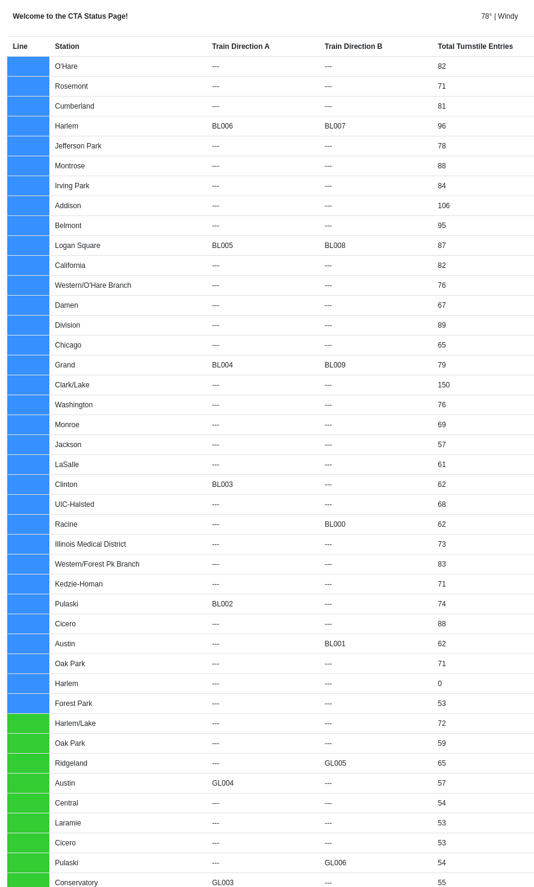
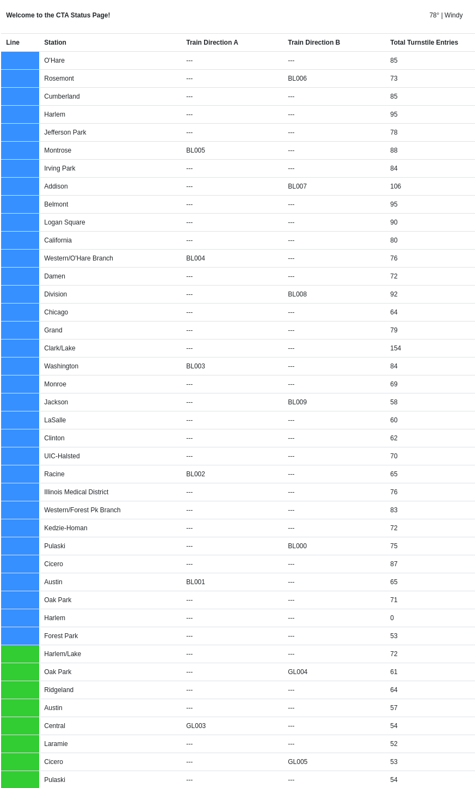
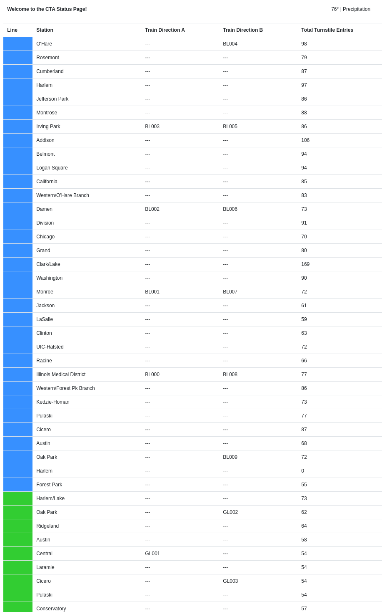
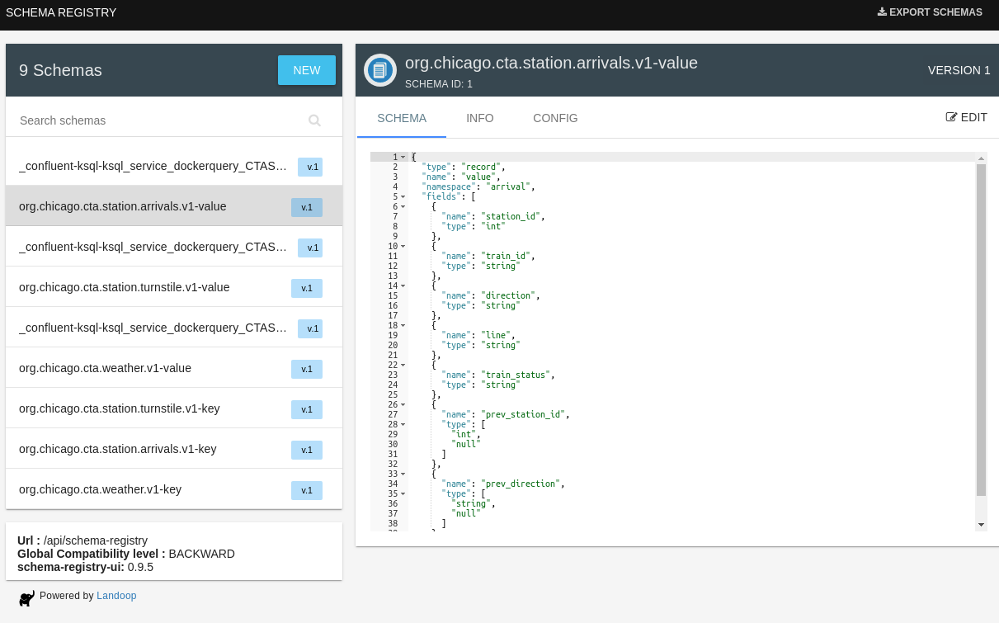
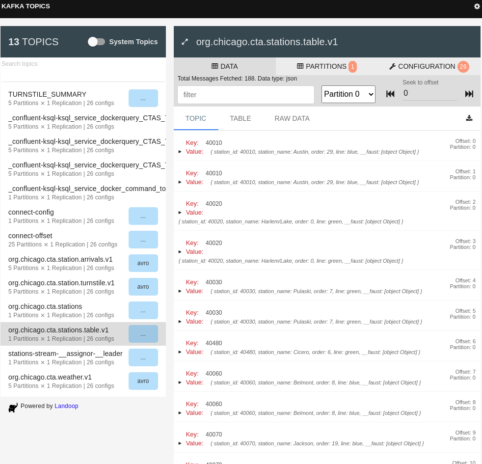
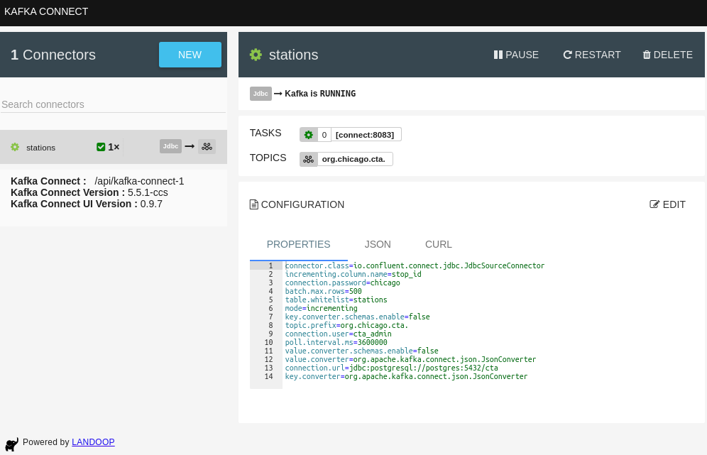

# Report: Chicago Transit Authority

## Final result
* run `python simulation.py` in producer folder,
```log
$ python simulation.py
2020-08-19 21:24:36,584 models.producer INFO     skip existing topic org.chicago.cta.station.arrivals.v1 creation
2020-08-19 21:24:37,597 models.producer INFO     skip existing topic org.chicago.cta.station.turnstile.v1 creation
2020-08-19 21:24:39,358 __main__     INFO     Beginning simulation, press Ctrl+C to exit at any time
2020-08-19 21:24:39,359 __main__     INFO     loading kafka connect jdbc source connector
2020-08-19 21:24:39,359 root         INFO     creating or updating kafka connect connector...
2020-08-19 21:24:39,589 root         INFO     connector already created skipping recreation
connector already created skipping recreation
2020-08-19 21:24:39,590 __main__     INFO     beginning cta train simulation
2020-08-19 21:24:39,593 models.producer INFO     skip existing topic org.chicago.cta.weather.v1 creation
^C2020-08-19 21:39:30,032 __main__     INFO     Shutting down
(mypy3) 

```
* then run `python server.py` in consumer folder. Wait for 15 sec and access `localhost:8888`:
```log
$ python server.py
2020-08-19 21:25:14,407 __main__     INFO     Open a web browser to http://localhost:8888 to see the Transit Status Page
2020-08-19 21:25:23,224 consumer     INFO     partitions assigned for org.chicago.cta.weather.v1
2020-08-19 21:25:23,415 consumer     INFO     partitions assigned for org.chicago.cta.stations.table.v1
2020-08-19 21:25:23,487 consumer     INFO     partitions assigned for ^org.chicago.cta.station.arrivals.
2020-08-19 21:25:23,588 consumer     INFO     partitions assigned for TURNSTILE_SUMMARY
^C2020-08-19 21:39:26,716 __main__     INFO     shutting down server
(mypy3)
```
* Screenshots (arrivals/turnstile change per 3 sec, temperature per 40 sec)




## Develop step
* I did in local environment, using the given `docker-compose.yml`.
* followed Project Directions/walkthrough: https://classroom.udacity.com/nanodegrees/nd029/parts/ebc913e4-e913-4499-813f-83cbc44ede10/modules/9d3b69c5-fa4e-4372-b31f-83060cabac9c/lessons/b2809b6c-fff1-41e0-a827-37c4aeb595ce/concepts/57dc5b19-05eb-4109-af9b-02337828670c

* producer first, and verified in `http://localhost:{8084/8085/8086}` for schema, topic, connectors
    * have issue of connector.py, the topic is not generated. Have to run `python connector.py`
    * for postgres, have to use docker URL, rather URL for connector, because it's internal uri.

Once docker-compose is ready, the following services will be available:

| Service | Host URL | Docker URL | Username | Password |
| --- | --- | --- | --- | --- |
| Public Transit Status | [http://localhost:8888](http://localhost:8888) | n/a | ||
| Landoop Kafka Connect UI | [http://localhost:8084](http://localhost:8084) | http://connect-ui:8084 |
| Landoop Kafka Topics UI | [http://localhost:8085](http://localhost:8085) | http://topics-ui:8085 |
| Landoop Schema Registry UI | [http://localhost:8086](http://localhost:8086) | http://schema-registry-ui:8086 |
| Kafka | PLAINTEXT://localhost:9092,PLAINTEXT://localhost:9093,PLAINTEXT://localhost:9094 | PLAINTEXT://kafka0:9092,PLAINTEXT://kafka1:9093,PLAINTEXT://kafka2:9094 |
| REST Proxy | [http://localhost:8082](http://localhost:8082/) | http://rest-proxy:8082/ |
| Schema Registry | [http://localhost:8081](http://localhost:8081/ ) | http://schema-registry:8081/ |
| Kafka Connect | [http://localhost:8083](http://localhost:8083) | http://kafka-connect:8083 |
| KSQL | [http://localhost:8088](http://localhost:8088) | http://ksql:8088 |
| PostgreSQL | `jdbc:postgresql://localhost:5432/cta` | `jdbc:postgresql://postgres:5432/cta` | `cta_admin` | `chicago` |

Note that to access these services from your own machine, you will always use the `Host URL` column.

When configuring services that run within Docker Compose, like **Kafka Connect you must use the Docker URL**. When you configure the JDBC Source Kafka Connector, for example, you will want to use the value from the `Docker URL` column.
* then consumer.

#### screenshots




## Issues:
### `python simulation.py` got Failed to establish a new connection: [Errno 16] Device or resource busy')
* solution
    * run command `ulimit -n 4096` in same terminal that run `python simulation.py` (this command is only affect current tab/terminal, rather global)
    * as in course forum: https://knowledge.udacity.com/questions/149305
* Symptom
```log
# fxrc @ pop in ~/Learn/UdacityNanodegree/mirror-Mehak97-udacity-kafka-streams/Chicago-transit-authority/starter/producers on git:master x [20:33:54] C:1
$ python simulation.py
2020-08-19 20:34:41,724 models.producer INFO     Creating topic org.chicago.cta.station.arrivals.v1
2020-08-19 20:34:43,726 models.producer CRITICAL failed to create topic org.chicago.cta.station.arrivals.v1: KafkaError{code=TOPIC_ALREADY_EXISTS,val=36,str="Topic 'org.chicago.cta.station.arrivals.v1' already exists."}
2020-08-19 20:34:43,727 models.producer INFO     Creating topic org.chicago.cta.station.turnstile.v1
2020-08-19 20:34:45,730 models.producer CRITICAL failed to create topic org.chicago.cta.station.turnstile.v1: KafkaError{code=TOPIC_ALREADY_EXISTS,val=36,str="Topic 'org.chicago.cta.station.turnstile.v1' already exists."}
2020-08-19 20:34:46,338 models.station CRITICAL HTTPConnectionPool(host='localhost', port=8081): Max retries exceeded with url: /subjects/org.chicago.cta.station.arrivals.v1-value/versions (Caused by NewConnectionError('<urllib3.connection.HTTPConnection object at 0x7f86584c30a0>: Failed to establish a new connection: [Errno 16] Device or resource busy'))
Traceback (most recent call last):
  File "/home/fxrc/miniconda3/envs/mypy3/lib/python3.8/site-packages/urllib3/connection.py", line 159, in _new_conn
  File "/home/fxrc/miniconda3/envs/mypy3/lib/python3.8/site-packages/urllib3/util/connection.py", line 61, in create_connection
  File "/home/fxrc/miniconda3/envs/mypy3/lib/python3.8/socket.py", line 918, in getaddrinfo
OSError: [Errno 16] Device or resource busy

During handling of the above exception, another exception occurred:

Traceback (most recent call last):
  File "/home/fxrc/miniconda3/envs/mypy3/lib/python3.8/site-packages/urllib3/connectionpool.py", line 670, in urlopen
  File "/home/fxrc/miniconda3/envs/mypy3/lib/python3.8/site-packages/urllib3/connectionpool.py", line 392, in _make_request
  File "/home/fxrc/miniconda3/envs/mypy3/lib/python3.8/http/client.py", line 1240, in request
  File "/home/fxrc/miniconda3/envs/mypy3/lib/python3.8/http/client.py", line 1286, in _send_request
  File "/home/fxrc/miniconda3/envs/mypy3/lib/python3.8/http/client.py", line 1235, in endheaders
  File "/home/fxrc/miniconda3/envs/mypy3/lib/python3.8/http/client.py", line 1006, in _send_output
  File "/home/fxrc/miniconda3/envs/mypy3/lib/python3.8/http/client.py", line 946, in send
  File "/home/fxrc/miniconda3/envs/mypy3/lib/python3.8/site-packages/urllib3/connection.py", line 187, in connect
  File "/home/fxrc/miniconda3/envs/mypy3/lib/python3.8/site-packages/urllib3/connection.py", line 171, in _new_conn
urllib3.exceptions.NewConnectionError: <urllib3.connection.HTTPConnection object at 0x7f86584c30a0>: Failed to establish a new connection: [Errno 16] Device or resource busy

During handling of the above exception, another exception occurred:

Traceback (most recent call last):
  File "/home/fxrc/miniconda3/envs/mypy3/lib/python3.8/site-packages/requests/adapters.py", line 439, in send
  File "/home/fxrc/miniconda3/envs/mypy3/lib/python3.8/site-packages/urllib3/connectionpool.py", line 724, in urlopen
  File "/home/fxrc/miniconda3/envs/mypy3/lib/python3.8/site-packages/urllib3/util/retry.py", line 439, in increment
urllib3.exceptions.MaxRetryError: HTTPConnectionPool(host='localhost', port=8081): Max retries exceeded with url: /subjects/org.chicago.cta.station.arrivals.v1-value/versions (Caused by NewConnectionError('<urllib3.connection.HTTPConnection object at 0x7f86584c30a0>: Failed to establish a new connection: [Errno 16] Device or resource busy'))

During handling of the above exception, another exception occurred:

Traceback (most recent call last):
  File "simulation.py", line 83, in <module>
  File "simulation.py", line 54, in __init__
  File "/home/fxrc/Learn/UdacityNanodegree/mirror-Mehak97-udacity-kafka-streams/Chicago-transit-authority/starter/producers/models/line.py", line 24, in __init__
  File "/home/fxrc/Learn/UdacityNanodegree/mirror-Mehak97-udacity-kafka-streams/Chicago-transit-authority/starter/producers/models/line.py", line 61, in _build_trains
  File "/home/fxrc/Learn/UdacityNanodegree/mirror-Mehak97-udacity-kafka-streams/Chicago-transit-authority/starter/producers/models/station.py", line 83, in arrive_b
  File "/home/fxrc/Learn/UdacityNanodegree/mirror-Mehak97-udacity-kafka-streams/Chicago-transit-authority/starter/producers/models/station.py", line 60, in run
  File "/home/fxrc/Learn/UdacityNanodegree/mirror-Mehak97-udacity-kafka-streams/Chicago-transit-authority/starter/producers/models/station.py", line 45, in run
  File "/home/fxrc/miniconda3/envs/mypy3/lib/python3.8/site-packages/confluent_kafka/avro/__init__.py", line 80, in produce
  File "/home/fxrc/miniconda3/envs/mypy3/lib/python3.8/site-packages/confluent_kafka/avro/serializer/message_serializer.py", line 107, in encode_record_with_schema
  File "/home/fxrc/miniconda3/envs/mypy3/lib/python3.8/site-packages/confluent_kafka/avro/cached_schema_registry_client.py", line 218, in register
  File "/home/fxrc/miniconda3/envs/mypy3/lib/python3.8/site-packages/confluent_kafka/avro/cached_schema_registry_client.py", line 167, in _send_request
  File "/home/fxrc/miniconda3/envs/mypy3/lib/python3.8/site-packages/requests/sessions.py", line 530, in request
  File "/home/fxrc/miniconda3/envs/mypy3/lib/python3.8/site-packages/requests/sessions.py", line 643, in send
  File "/home/fxrc/miniconda3/envs/mypy3/lib/python3.8/site-packages/requests/adapters.py", line 516, in send
requests.exceptions.ConnectionError: HTTPConnectionPool(host='localhost', port=8081): Max retries exceeded with url: /subjects/org.chicago.cta.station.arrivals.v1-value/versions (Caused by NewConnectionError('<urllib3.connection.HTTPConnection object at 0x7f86584c30a0>: Failed to establish a new connection: [Errno 16] Device or resource busy'))
(mypy3)

```