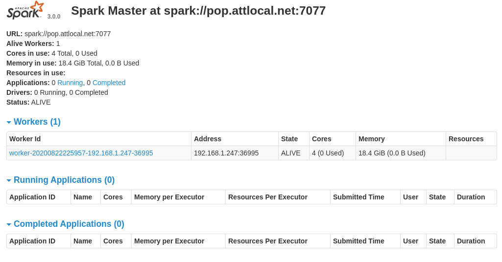

# Setup Local Environment

## Java, Scala, Spark
* Installed JDK, Scala via sdkman
* Download Spark, untar, 755, and `export SPARK_HOME="/opt/spark-3.0.0-bin-hadoop3.2"` in `~/.zshrc` 
```
$ tar -xf ~/Downloads/spark-3.0.0-bin-hadoop3.2.tgz -C /opt/
$ chmod -R 755 /opt/spark-3.0.0-bin-hadoop3.2
# fxrc @ pop in ~ [22:57:39] 
$ echo ${SPARK_HOME}
/opt/spark-3.0.0-bin-hadoop3.2
# fxrc @ pop in ~ [23:01:58] 
$ echo ${JAVA_HOME} 
/home/fxrc/.sdkman/candidates/java/current
# fxrc @ pop in ~ [23:02:04] 
$ echo ${SCALA_HOME}
/home/fxrc/.sdkman/candidates/scala/current
```

## Try Spark
* `${SPARK_HOME}/sbin/start-all.sh`, then got immediate error:
```
$ ${SPARK_HOME}/sbin/start-all.sh 
starting org.apache.spark.deploy.master.Master, logging to /opt/spark-3.0.0-bin-hadoop3.2/logs/spark-fxrc-org.apache.spark.deploy.master.Maste
r-1-pop.out                                                            
localhost: ssh: connect to host localhost port 22: Connection refused 
```
* found the issue that I need to install: `sudo apt-get install openssh-server`. According to https://jimolonely.github.io/2019/09/15/linux/031-ubuntu-ssh-connection-refuesd/
* then retry:
```
$ ${SPARK_HOME}/sbin/start-all.sh    
org.apache.spark.deploy.master.Master running as process 3464942.  Stop it first.
localhost: Warning: Permanently added 'localhost' (ECDSA) to the list of known hosts.
fxrc@localhost's password: 
localhost: starting org.apache.spark.deploy.worker.Worker, logging to /opt/spark-3.0.0-bin-hadoop3.2/logs/spark-fxrc-org.apache.spark.deploy.worker.Worker-1-pop.out
```
* and verify, according to: https://jimolonely.github.io/2019/09/15/spark/008-spark-standalone-conf-run/
	* or goto Spark UI: http://localhost:8080/
	
```
# fxrc @ pop in ~ [23:08:44] 
$ jps          
3482711 Jps
3464942 Master
3470478 Worker
8780 

# fxrc @ pop in ~ [23:09:40] 
$ tldr jps                                                  
jps
Show JVM Process Status of current user.

 - List all JVM processes:
   jps

 - List all JVM processes with only PID:
   jps -q

 - Display the arguments passed to the processes:
   jps -m

 - Display the full package name of all processes:
   jps -l

 - Display the arguments passed to the JVM:
   jps -v

```