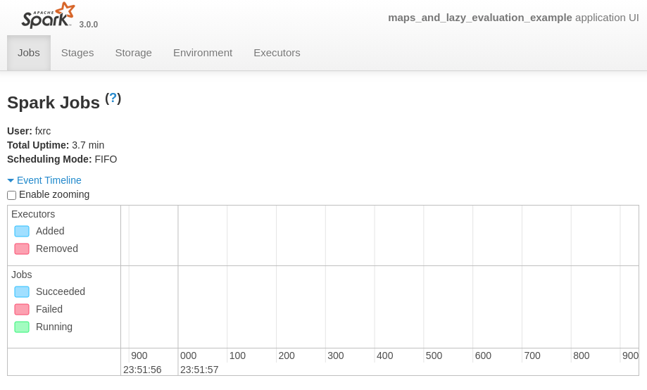

# Setup Local Environment

## SparkUI (default :4040)
* each Spark (?) will spin-up a SparkUI.
  * if I open 2 ipynb and `findspark.init()`, then the 2nd one will go for 4041, and so on:


```
[I 23:51:52.778 LabApp] Saving file at /classroom/spark_maps_and_lazy_eval.ipynb
WARNING: An illegal reflective access operation has occurred
WARNING: Illegal reflective access by org.apache.spark.unsafe.Platform (file:/opt/spark-3.0.0-bin-hadoop3.2/jars/spark-unsafe_2.12-3.0.0.jar) to constructor java.nio.DirectByteBuffer(long,int)
WARNING: Please consider reporting this to the maintainers of org.apache.spark.unsafe.Platform
WARNING: Use --illegal-access=warn to enable warnings of further illegal reflective access operations
WARNING: All illegal access operations will be denied in a future release
20/08/22 23:51:56 WARN NativeCodeLoader: Unable to load native-hadoop library for your platform... using builtin-java classes where applicable
Using Spark's default log4j profile: org/apache/spark/log4j-defaults.properties
Setting default log level to "WARN".
To adjust logging level use sc.setLogLevel(newLevel). For SparkR, use setLogLevel(newLevel).
20/08/22 23:51:57 WARN Utils: Service 'SparkUI' could not bind on port 4040. Attempting port 4041.

```
* you can verify by `jps`, and `sudo ss -tulpn | grep :4040`
```
# fxrc @ pop in ~/Learn/UdacityNanodegree/Udacity-Data-Streaming/sf-crime-data on git:master x [23:54:32]
$ ss -tulpn | grep :4040 
tcp     LISTEN   0        1                                           *:4040                                               *:*                                   users:(("java",pid=3533800,fd=298))
(base)
# fxrc @ pop in ~/Learn/UdacityNanodegree/Udacity-Data-Streaming/sf-crime-data on git:master x [23:54:38]
$ jps
3544580 Jps
3464942 Master
3470478 Worker
3540684 SparkSubmit
8780
3533800 SparkSubmit
# I shutdonw'ed kernel on 1st ipynb, then this pid: 3533800 is gone.
# fxrc @ pop in ~/Learn/UdacityNanodegree/Udacity-Data-Streaming/sf-crime-data on git:master x [23:54:44]
$ jps
3545201 Jps
3464942 Master
3470478 Worker
3540684 SparkSubmit
8780
```

## install requirements.txt
1. activate conda env: `conda activate mypy3`
2. pip install: `pip install -r requirements.txt`, this will use conda's pip to install requirements into conda env.
3. need jupyterlab: `conda install -c conda-forge jupyterlab`
4. start jupyterlab: `jupyter lab`

## Java, Scala, Spark
* Installed JDK, Scala via sdkman
* Download Spark, untar, 755, and `export SPARK_HOME="/opt/spark-3.0.0-bin-hadoop3.2"` in `~/.zshrc`, followed: http://www.mtitek.com/tutorials/bigdata/spark/install.php
```
$ tar -xf ~/Downloads/spark-3.0.0-bin-hadoop3.2.tgz -C /opt/
$ chmod -R 755 /opt/spark-3.0.0-bin-hadoop3.2
# fxrc @ pop in ~ [22:57:39] 
$ echo ${SPARK_HOME}
/opt/spark-3.0.0-bin-hadoop3.2
# fxrc @ pop in ~ [23:01:58] 
$ echo ${JAVA_HOME} 
/home/fxrc/.sdkman/candidates/java/current
# fxrc @ pop in ~ [23:02:04] 
$ echo ${SCALA_HOME}
/home/fxrc/.sdkman/candidates/scala/current
```

## Start Spark standalone local
* `${SPARK_HOME}/sbin/start-all.sh`, then got immediate error:
```
$ ${SPARK_HOME}/sbin/start-all.sh 
starting org.apache.spark.deploy.master.Master, logging to /opt/spark-3.0.0-bin-hadoop3.2/logs/spark-fxrc-org.apache.spark.deploy.master.Maste
r-1-pop.out                                                            
localhost: ssh: connect to host localhost port 22: Connection refused 
```
* found the issue that I need to install: `sudo apt-get install openssh-server`. According to https://jimolonely.github.io/2019/09/15/linux/031-ubuntu-ssh-connection-refuesd/
* then retry:
```
$ ${SPARK_HOME}/sbin/start-all.sh    
org.apache.spark.deploy.master.Master running as process 3464942.  Stop it first.
localhost: Warning: Permanently added 'localhost' (ECDSA) to the list of known hosts.
fxrc@localhost's password: 
localhost: starting org.apache.spark.deploy.worker.Worker, logging to /opt/spark-3.0.0-bin-hadoop3.2/logs/spark-fxrc-org.apache.spark.deploy.worker.Worker-1-pop.out
```
* and verify, according to: https://jimolonely.github.io/2019/09/15/spark/008-spark-standalone-conf-run/
	* or goto Spark UI: http://localhost:8080/
	
```
# fxrc @ pop in ~ [23:08:44] 
$ jps          
3482711 Jps
3464942 Master
3470478 Worker
8780 

# fxrc @ pop in ~ [23:09:40] 
$ tldr jps                                                  
jps
Show JVM Process Status of current user.

 - List all JVM processes:
   jps

 - List all JVM processes with only PID:
   jps -q

 - Display the arguments passed to the processes:
   jps -m

 - Display the full package name of all processes:
   jps -l

 - Display the arguments passed to the JVM:
   jps -v

```

## Use PySpark in terminal
* it's from `${SPARK_HOME}/bin`
```
# fxrc @ pop in ~ [23:06:59]
$ ${SPARK_HOME}/bin/pyspark
Python 3.7.4 (default, Aug 13 2019, 20:35:49)
[GCC 7.3.0] :: Anaconda, Inc. on linux
Type "help", "copyright", "credits" or "license" for more information.
WARNING: An illegal reflective access operation has occurred
WARNING: Illegal reflective access by org.apache.spark.unsafe.Platform (file:/opt/spark-3.0.0-bin-hadoop3.2/jars/spark-unsafe_2.12-3.0.0.jar) to constructor java.nio.DirectByteBuffer(long,int)
WARNING: Please consider reporting this to the maintainers of org.apache.spark.unsafe.Platform
WARNING: Use --illegal-access=warn to enable warnings of further illegal reflective access operations
WARNING: All illegal access operations will be denied in a future release
20/08/22 23:25:11 WARN NativeCodeLoader: Unable to load native-hadoop library for your platform... using builtin-java classes where applicable
Using Spark's default log4j profile: org/apache/spark/log4j-defaults.properties
Setting default log level to "WARN".
To adjust logging level use sc.setLogLevel(newLevel). For SparkR, use setLogLevel(newLevel).
Welcome to
      ____              __
     / __/__  ___ _____/ /__
    _\ \/ _ \/ _ `/ __/  '_/
   /__ / .__/\_,_/_/ /_/\_\   version 3.0.0
      /_/

Using Python version 3.7.4 (default, Aug 13 2019 20:35:49)
SparkSession available as 'spark'.
>>> spark.version
'3.0.0'
```

## Use Spark-shell for Scala in terminal
* similar to pyspark, also in `bin/`
```
# fxrc @ pop in ~ [23:26:50] C:127
$ ${SPARK_HOME}/bin/spark-shell
WARNING: An illegal reflective access operation has occurred
WARNING: Illegal reflective access by org.apache.spark.unsafe.Platform (file:/opt/spark-3.0.0-bin-hadoop3.2/jars/spark-unsafe_2.12-3.0.0.jar) to constructor java.nio.DirectByteBuffer(long,int)
WARNING: Please consider reporting this to the maintainers of org.apache.spark.unsafe.Platform
WARNING: Use --illegal-access=warn to enable warnings of further illegal reflective access operations
WARNING: All illegal access operations will be denied in a future release
20/08/22 23:27:03 WARN NativeCodeLoader: Unable to load native-hadoop library for your platform... using builtin-java classes where applicable
Using Spark's default log4j profile: org/apache/spark/log4j-defaults.properties
Setting default log level to "WARN".
To adjust logging level use sc.setLogLevel(newLevel). For SparkR, use setLogLevel(newLevel).
Spark context Web UI available at http://pop.attlocal.net:4040
Spark context available as 'sc' (master = local[*], app id = local-1598164029387).
Spark session available as 'spark'.
Welcome to
      ____              __
     / __/__  ___ _____/ /__
    _\ \/ _ \/ _ `/ __/  '_/
   /___/ .__/\_,_/_/ /_/\_\   version 3.0.0
      /_/
         
Using Scala version 2.12.10 (OpenJDK 64-Bit Server VM, Java 11.0.8)
Type in expressions to have them evaluated.
Type :help for more information.

scala> spark.version
res0: String = 3.0.0
```